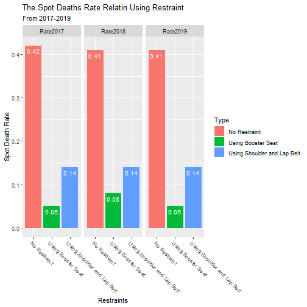
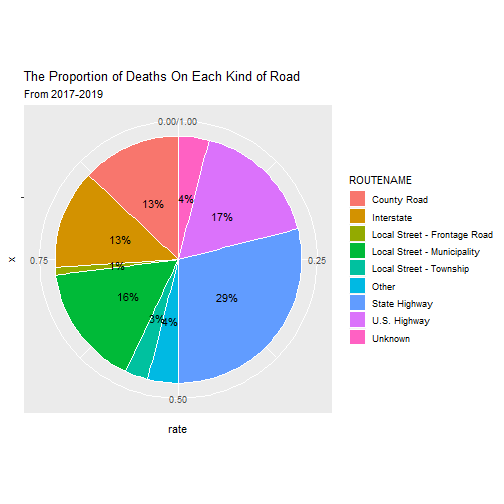
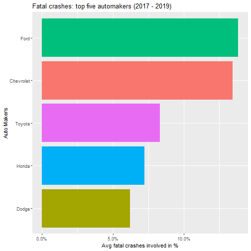
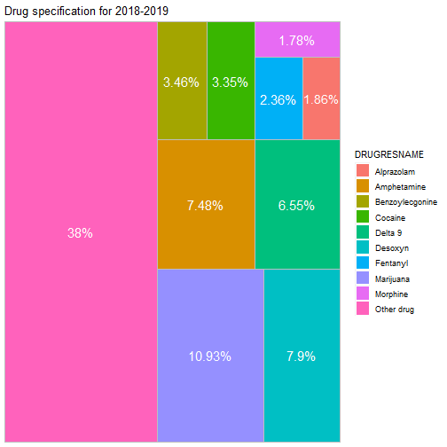

<!--
<div align = "center"><h1>Carccident: Analysis of fatal motor vehicle crashes in US</h1></div>

<div align = "center">Yuhan Zhang, Steven Chen, Qiuqing(Echo) Ge, Ximing Sun</div>-->

<br>
<div align = "center">
The Information School - University of Washington<br>
INFO-201: Technical Foundations of Informatic<br>
David G Hendry<br>
Winter 2022
</div>

<br>

<!---->
<p align = "center">
  
</p>

<br>
<br>

<div align = "center"><h2>Abstract</h2></div>

&nbsp;&nbsp;&nbsp;&nbsp;We are concerned with car accidents, because of the high death rate of car accidents. To address this concern, we plan to use R programming to show some facts and pay more attention to driving safety issues and obey traffic rules.

_Keywords_: car accident, severity, the U.S., factor.

<br>
<br>

<div align = "center"><h2>Introduction</h2></div>

&nbsp;&nbsp;&nbsp;&nbsp;We will analyze **car accidents** from _**four main**_ aspects: **Using Restraint, drugs, and road classification, weather conditions** from _**2017 to 2019**_ in the US. _Using Restraint_ is especially important on the car. The _Using Restraint_ is **calculating** Spot Death Rate relating using retraint from 2017 to 2019. We are also concerned about the location of happening car accident, because the **roughness of the road** also has some impact on the cause of car accidents. Under this condition, we will also mention the classification of roads in the data set to show the influence of status of the road condition. Sometimes the **weather conditions** also have an influence on car accidents. We also want to introduce this aspect to fulfill our project and mention the importance of the outside environment for people who drive the cars.

<br>
<br>

<div align = "center"><h2>Design Situation</h2></div>

#### Date Frame:

&nbsp;&nbsp;&nbsp;&nbsp;Our project is about **our life - car accidents**. This question is also concerned by the United States Department of Transportation. The United States Department of Transportation has already collected the data related to car accidents from 1975-2019. The inspiration of our project is mainly from **two related research**. The first one is about the relationship between the drivers's personality and the possibility of being involved in car accidents [(Hu, 2020)](https://www.hindawi.com/journals/jat/2020/9084245/), while the second is mainly about the relationship between laws and traffic accidents [(Rolison, 2018)](https://www.sciencedirect.com/science/article/pii/S0001457518300873 ). For our project, we want to emerge in the relationship between road classification, natural conditions and region, using R language to analyse and summarize data to get our final conclusions.

#### Human Values:

&nbsp;&nbsp;&nbsp;&nbsp;**Love, Empathy, Responsibility**. These values are derived from the _**panic**_ after seeing a relative in a car accident or shocking images in the daily news. Public service announcements about drunk driving and tired driving often appear on television, the debris from crashes, screeching brakes, injured people lying on the road. This series of scenes will make people feel really dismal. We sincerely hope from the bottom of our hearts that traffic accidents can be reduced. Then, **Responsibility will be activated by love and empathy.**

#### Direct Stakeholders:

&nbsp;&nbsp;&nbsp;&nbsp;We think the direct stakeholders are **drivers, passengers and policemen**. As for drivers, they are likely to encounter car accidents, since they drive the cars all day. Because the passengers are likely to be involved in car accidents by chance. Policemen can be injured by car accidents while directing traffic.

#### Indirect Stakeholders:

&nbsp;&nbsp;&nbsp;&nbsp;We think indirect stakeholders are **drivers' families, automobile manufacturers, insurance companies**. If drivers are injured in car accidents or need to take responsibility for these car accidents, their family may face substantial reparations. The automobile manufacturers are also impacted by car accidents. Definitely, people will not buy the cars that are always involved in accidents. In this case, the manufacturers of this kind of car will be bankrupt. In car accidents, Insurance companies pay for the owner of the car whose car has collapsed.

#### Benefits:

&nbsp;&nbsp;&nbsp;&nbsp;With the result from this project, drivers and police would **pay more attention to certain conditions** which would cause severe consequences. Manufacturers would learn how to **prevent these accidents happening** when in bad weather conditions. We suppose to call up attention from all society about the possibility.

#### Harm:

&nbsp;&nbsp;&nbsp;&nbsp;When we sort out this data, insurance companies may increase the insurance amount for accidents or related vehicles and reduce the payment amount of insurance companies. This will **harm the interests of car owners**.

<br>
<br>

<div align = "center"><h2>Research Questions</h2></div>

- **What is the spot death rate relating to using restraint in car accidents from 2017 to 2019?**.
Nowadays, road traffic safety is deteriorating, and road traffic accidents have become a major problem affecting society and people's lives. We want to use the strike death rate of not using any restraint in car accidents compared with death rate of using restraint to alert people using restraint on the car and improve this situation.

<br>

- **Is there a link between road classification and death number in car accidents?** In states with higher income, does the number of car accidents increase because of the increment of car ownership? Since people are inclined to race fast whenever they are, roads with better condition, usually with higher classification, could lead drivers to race on them.

<br>

- **Which auto makes involved in most fatal crashes in US?**  Each manufacturers design their products in different ways. Although model regulations and laws have enforce many safety features in the automobile industry, auto makers always make compromises when it comes to cost and safety. Using datasets we gathered, we want to find makers that involved the most in fatal crashes. Then based on the environment conditions and crash characteristics of each fatal crashes, depicts the model of what are common factors of fatal crashes of each auto makers.

<br>


- **What is the proportion of addicted driving?** For nowadays, drugs problem is concerning people living over world, and we want to find out if there is a high rate of addicted driving for fatal crashes? Since FARS only has 2018 and 2019 data for drugs situations, we would use their data for these years and find out the percentage of drug test positive cases and what is the most popular, in many cases is the marijuana, and have a sight into the situation of drugs in U.S..

<br>
<br>

<div align = "center"><h2>The Dataset</h2></div>

#### **[FARS: Fatal Motor Vehicle Accidents vehicle](https://www.nhtsa.gov/node/97996/251)**<br>
&nbsp;&nbsp;&nbsp;&nbsp;[^1]FARS is a census of fatal motor vehicle crashes with a set of data files documenting all qualifying fatalities that occurred within the 50 States, the District of Columbia, and Puerto Rico since 1975. This dataset contains 33519 observations of fatal motor vehicle crashes that occurred on public roads. The data consists of 95 properties that documented crash characteristics and environmental conditions of each incident. The data is collected and organized by the National Highway Traffic Safety Administration and aims to reduce the staggering human toll and property damage that motor vehicle traffic crashes impose on our society.

#### **[US-Accidents: A Countrywide Traffic Accident Dataset](https://www.kaggle.com/sobhanmoosavi/us-accidents)**<br>
&nbsp;&nbsp;&nbsp;&nbsp;This dataset crawls traffic accidents data from online data providers including several APIs that stream the traffic event data. These APIs broadcast traffic events captured by a variety of entities, such as the US and state departments of transportation, law enforcement agencies, traffic cameras, and traffic sensors within the road-networks. The dataset is collected and organized by Sobhan Moosavi and shared on Kaggle. In the dataset Mossavi uses 47 properties to document the environmental conditions, crash characteristics, and impact to the traffic. The current dataset has about 1.5 millions(1516064) observations across 49 states in the US, excluding data from the state of Hawaii.


#### **[Fatal Motor Vehicle Accidents vehicle](https://data-usdot.opendata.arcgis.com/datasets/fatal-motor-vehicle-accidents-vehicle/explore)**<br>
&nbsp;&nbsp;&nbsp;&nbsp;This dataset is collected and organized by the National Highway Traffic Safety Administration and aims to reduce the staggering human toll and property damage that motor vehicle traffic crashes impose on our society. It consists of more than 60 unique properties that documented information about the vehicle involved in fatal crashes in the year of 2019 including the model, year, tires, and etc. It now had documented 28,972 vehicles involved.

<br>
<br>

<div align = "center"><h2>Findings</h2></div>

**What is the spot death rate relating to using restraint in car accidents from 2017 to 2019?**.



&nbsp;&nbsp;&nbsp;&nbsp;This chart shows on-the-spot mortality rates relating to using restraint from 2017 to 2019. As can be clearly seen from the chart. The spot death rate of those who have not used any safety measures is much higher than those who have used safety belt or using booster seat This is a reminder that people must use Restraint on the car.

<br>

**Is there a link between road classification and death number in car accidents?**



&nbsp;&nbsp;&nbsp;&nbsp;By using R, it is easily to find the relationship between road classification and death number from 2017 to 2019. First download the dataset I want to analyze, and then distract the thing (the road classification and the death number) I need from the dataset from each years. Next step is that join the three dataset together and calculated the the total number of 2017 - 2019. And find The proportion of deaths on different roads to total deaths. Finally, make a pie chart to find the proportion between the number of death and the road classification.

&nbsp;&nbsp;&nbsp;&nbsp;The purpose of pie chart is that It's to warn people on what roads to be more careful in case of a car accident, because it shows the relationship between the proportion death and the road classification. My chart analyzes the death rates on different types of roads from 2017 to 2019, as you can see highway in generally (state highway, U.S. Highway and interstate) is about 59 percent. So, when people drives cars on highway should pay more attention and avoid the car accident.

&nbsp;&nbsp;&nbsp;&nbsp;But for this chart, it has some flaws that the number of people walking on each road is not the same. Under this condition, there will be more people on the road, the possibility of accidents will be higher. But this study cannot solve this problem, because there is no data on the total number of people driving on each road, so it is impossible to remedy this deficiency.

<br>

**Which auto makes involved in most fatal crashes in US?**



&nbsp;&nbsp;&nbsp;&nbsp;The above bar chart indicates the top five auto makers that involved in fatal vehicle crashes from 2017 to 2019 in US. These five auto makers made up about 25% of all fatal crashes among 70 auto makers the datasets account for occured in the selected three years period. By analysing the crash characteristics and environmental conditions of crashes of those five brands, we will be able to model the typical characteristics of crashes and how their products protect the driver and passengers when accident takes place.

<br>

**What is the proportion of addicted driving?**



&nbsp;&nbsp;&nbsp;&nbsp;For cases in 2018 and 2019, around half of people in fatal car accidents had been tested for drugs. For cases that has test record, in 2018, only 30.14% cases had negative result, and for 2019, the percentage, which is 26.17%, doesn't change too much. In this chart, "other drugs" include those special cases and some drugs which is mixed by multiple chemicals. Despite the other drugs, the largest genre is marijuana, which is always considered in U.S. as a not very serious drug, and it stands for the largest part both in 2018 and 2019. This shows that people's ignorance for marijuana leads to addicted driving, and sometimes to severe car accidents.

<br>

**Table of Critical Information**


| Year| Case_ID|Use_of_Restraint           |Death_Type     |Route_Type | Num_Death|Drug_Use        |Auto_Maker |
|----:|-------:|:--------------------------|:--------------|:----------|---------:|:---------------|:----------|
| 2019|   10002|Reported as Unknown        |Died at Scene  |Interstate |         1|AMPHETAMINE     |BMW        |
| 2019|   10002|Reported as Unknown        |Died at Scene  |Interstate |         1|Test Not Given  |BMW        |
| 2019|   10002|Reported as Unknown        |Died at Scene  |Interstate |         1|METHAMPHETAMINE |BMW        |
| 2019|   10002|Shoulder and Lap Belt Used |Not Applicable |Interstate |         1|METHAMPHETAMINE |Chevrolet  |
| 2019|   10002|Shoulder and Lap Belt Used |Not Applicable |Interstate |         1|AMPHETAMINE     |Chevrolet  |
| 2019|   10002|Shoulder and Lap Belt Used |Not Applicable |Interstate |         1|Test Not Given  |Chevrolet  |
This table shows the sample data we concluded for a single case that can be used to answer four questions we purposed. We analyize cases in a year first then combine them for three year charts. A case usually consist of six different aspects as indicated by the column name of table. The case id is number assigned to identify a case which is unique in one year. One thing that requires attention is that due to the classification approach took by NHTSA, repeated row occurs when one of the six aspects is different as shown in the table.

<br>
<br>

<div align = "center"><h2>Discussion</h2></div>

<br>

<div align = "center"><h4>Implications</h4></div>

&nbsp;&nbsp;&nbsp;&nbsp;Impacted by our car accident data, Car drivers, Vehicle manufactures , Government will adhere to the principle of **"safety"**. And attach more attention to driving safety in accident-prone roads, such as slow down, pay attention to the driving of large cars, and for the safety of their own life and others, do not take drugs when driving. Vehicle manufactures improve the production and testing process by identifying the frequency of Vehicle manufactures in the data graph for car accident rate of the different brands.The Government will focus on formulating road safety policies to reduce the incidence of accidents on accident-prone roads.

<br>

<div align = "center"><h4>Limitations</h4></div>

&nbsp;&nbsp;&nbsp;&nbsp;There are three limitations for this project. For the first chart, the statistical variety is not very comprehensive, we can only summarizes the same restriction ways in the three years. Another limitations is that the data for the second plot is kind of inaccurate, because some data is lost. The final limitations is that we find some data for the fourth plot is inadequate.  It only has two years (from 2018 to 2019).

<br>
<br>

<div align = "center"><h2>Conclusion</h2></div>

```
## Error in summary[[5]]: object of type 'closure' is not subsettable
```

```
## Error in summary[[6]]: object of type 'closure' is not subsettable
```

```
## Error in summary[[7]]: object of type 'closure' is not subsettable
```

```
## Error in summary[[8]]: object of type 'closure' is not subsettable
```

```
## Error in summary[[2]]: object of type 'closure' is not subsettable
```

```
## Error in summary[[4]]: object of type 'closure' is not subsettable
```

```
## Error in summary[[3]]: object of type 'closure' is not subsettable
```

```
## Error in summary[[1]]: object of type 'closure' is not subsettable
```


